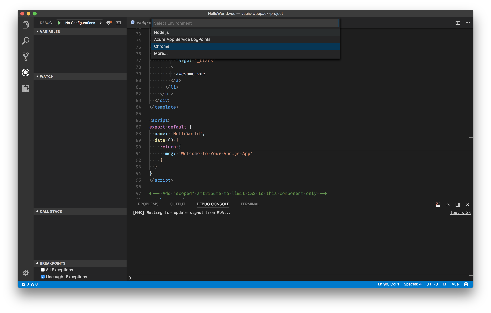

# Vue.js debugging in VS Code with Chrome and vue-cli

by [Kenneth Auchenberg](https://twitter.com/auchenberg)

This recipe shows how to use the [Debugger for Chrome](https://github.com/Microsoft/vscode-chrome-debug) extension with VS Code to debug Vue.js applications generated by the [Vue CLI](https://github.com/vuejs/vue-cli).

## Getting Started

1. Make sure to have [Google Chrome](https://www.google.com/chrome) installed in its default location.

2. Make sure to the latest version of [Debugger for Chrome](https://marketplace.visualstudio.com/items?itemName=msjsdiag.debugger-for-chrome) extension installed in VS Code.

3. Use [NPM](https://www.npmjs.com) to install [vue-cli](https://github.com/vuejs/vue-cli)

    ```
    npm install -g vue-cli
    ```

4. Use Vue CLI to create a new Vue.js app.

    ```
    vue init webpack vuejs-webpack-project
    ```

5. Change to the newly created application directory and open VS Code.

    ```
    cd vuejs-webpack-project
    code .
    ```

## Update your webpack configuration

Before you can debug your Vue components from VS Code you need to update the generated webpack config to build sourcemaps that contains more information for our debugger.

- Go to `config/index.js` and find the `devtool` property. Update it to:

```json
devtool: 'source-map',
```

## Configure launch.json File

1. Click on the Debugging icon in the Activity Bar to bring up the Debug view.
Then click on the gear icon to configure a launch.json file, selecting **Chrome** for the environment:

   

2. Replace content of the generated launch.json with the following two configurations:

```json
  {
    "version": "0.2.0",
    "configurations": [
        {
            "type": "chrome",
            "request": "launch",
            "name": "vuejs: chrome",
            "url": "http://localhost:8080",
            "webRoot": "${workspaceFolder}/src",
            "breakOnLoad": true,
            "sourceMapPathOverrides": {
                "webpack:///src/*": "${webRoot}/*"
            }
        }
    ]
}
```

## Start Debugging

1. Set a breakpoint in **src/components/HelloWorld.vue** on `line 90` where the `data` function returns a string.


2. Open your favorite terminal at the root folder and serve the app using Vue CLI:

  ```
  npm start
  ```

3. Go to the Debug view, select the **'vuejs: chrome'** configuration, then press F5 or click the green play button.

4. Your breakpoint should now be hit as the new instance of Chrome opens `http://localhost:8080`.


5. Party 🎉🔥